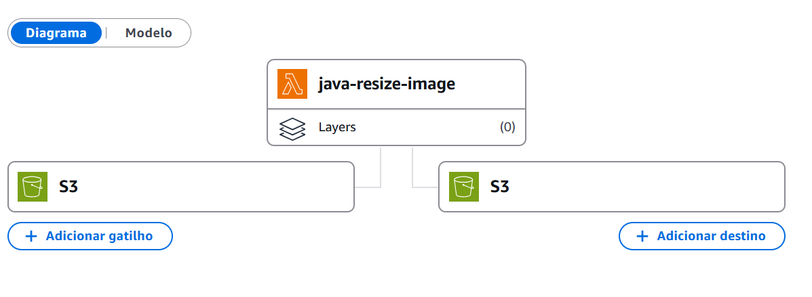
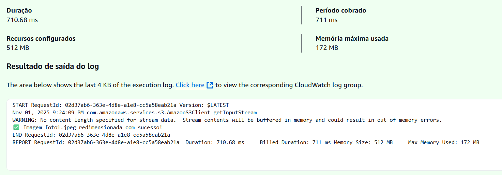
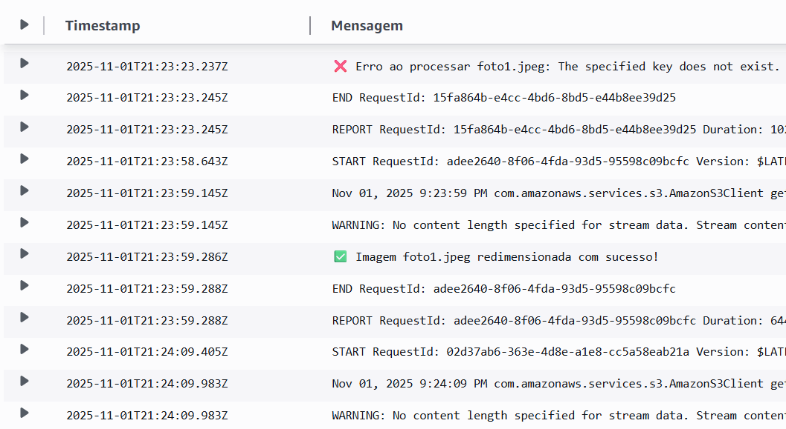

# 📦 Projeto Java AWS S3 – Processamento de Imagens

Este projeto marca o **último desafio da minha jornada no Code Girls**! 👩🏻‍💻💜
Depois de muitas linhas de código, noites de estudo e desafios superados, estou finalizando o bootcamp e celebrando tudo o que aprendi.

Neste projeto, desenvolvi uma solução para processar imagens usando **Java** e **AWS S3**, aplicando conceitos de desenvolvimento de sistemas, integração com a nuvem e boas práticas de organização de arquivos!

Um agradecimento especial a todas as minhas colegas **devs** que compartilharam experiências, dúvidas e motivação ao longo do caminho. Este é o momento de colocar tudo em prática e mostrar como crescemos juntas! 📁✨

---

## 🎯 Objetivo

* Receber imagens em um **bucket de entrada**.
* Processar essas imagens com **Java**.
* Salvar os arquivos processados em um **bucket de saída**.
* Monitorar a execução usando **logs**, que ajudam a identificar erros rapidamente.

---

## 📂 Estrutura do Projeto

* **Bucket de Entrada:** onde os arquivos originais são enviados.
* **Bucket de Saída:** onde os arquivos processados ficam armazenados.
* **Código Java:** realiza o processamento das imagens.
* **Logs:** mostram exatamente onde podem ocorrer problemas durante a execução.

---

## 🚀 Como Executar

1. Clone o repositório:

```bash
git clone https://github.com/nataliatsi/java-resize-image
cd .\java-resize-image\
```

2. Gere o `.jar` usando Maven:

```bash
mvn clean package
```

O `.jar` será criado dentro da pasta `target`.

3. Faça o upload do `.jar` para a AWS Lambda (ou outro serviço compatível com Java).

4. Configure os buckets de entrada e saída no código ou via variáveis de ambiente.

5. Execute a função e acompanhe os **logs** para verificar a execução e identificar possíveis erros.

---

### Exemplos / Visualização

1. Diagrama da AWS



2. Resultado do teste



1. Trecho dos logs



---

#### ⚠️ Observações

* Sempre verifique os logs para identificar problemas.
* Qualquer alteração no código exige gerar um novo `.jar` e fazer upload novamente.
* O uso de dois buckets garante que o fluxo de entrada e saída das imagens seja organizado.
